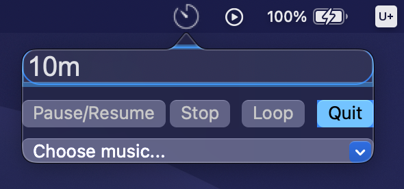

# NLUTimer

This is a Mac OSX app that shows timer in the menu bar. This timer accepts inputs like `1h 30m`, `1483s`, etc. When time's up, the timer will send a notification and play a music to alert users.

## How to Install

Just download this timer from [here](https://github.com/wjohn1483/NLUTimer/releases/download/v1.0/NLUTimer.app.zip), unzip it, and double-click it.

## How to Use

After open up this timer, it'll show a textfield for typing. Just input the amount of time that you want to countdown and press `Enter`.

Click `Pause/Resume` to pause or resume the timer, click `Stop` to cancel the timer, and click `Quit` to quit this program.

Timer will show remaining time in menu bar.

To stop the music while time's up, click menu bar icon or click on the notification it sends.

There is a default shortcut `⌥⌘k` (Option+Command+k) to show/hide this timer.

## Thanks

This app was heavily inspired by [Horo](https://apps.apple.com/us/app/horo-timer-for-menu-bar/id1437226581?mt=12). It is recommended to download it for better experience.

